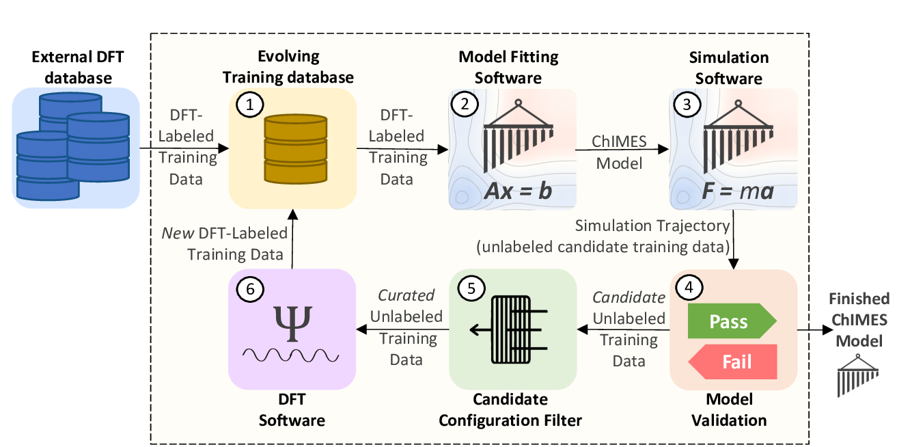

.. _page-clusterAL

***************************************
Cluster AL Fitting Mode
***************************************

  
  **Fig. 1:** The ChIMES Active Learning Driver Workflow.

When developing models for molecular reacting systems, our cluster-based active learning (AL) can be advantageous. This AL strategy attemps to improve description of conformational energetics and nominal reaction barriers. This is achieved by supplementing the basic mode by carving out candidate molecules  and nominal transition states from DFT- and ChIMES-generated simulation trajectories , down-selecting a maximally informative subset, and adding them to the training set. Details of this strategy are outlined in `R.K. Lindsey et al, JCP 2020 <https://doi.org/10.1063/5.0021965>`_. 

... Warning::

    This capability will only run on Slurm systems, and may require a specific Slurm specification. See the ``utilities/new*sh`` files for details.

-------

============================
Example Fit: Water
============================

.. Note ::

    Files for this example are located in ``./<al_driver base folder>/examples/cluster_based_active_learning_single_statepoint-VASP/``
    
In this section, an example 1-iteration fit for water at 1000 K and 1.25 g/cc is overviewed. The model will include up-to-three body interactions with the following hyperparameters. Note: This example is intended to run quickly and will not yield neither a quality nor stable model.

=====================   =============
Hyperparameter          Value   
=====================   =============
2-body order            12    
2-body outer cutoff     5
3-body order            3
3-body outer cutoff     3.5
OO inner cutoff         2.31
HH inner cutoff         1.18
OH inner cutoff         0.82
Morse lambda            1.00
Tersoff parameter       0.75
=====================   =============

------------------------------------------
Input Files 
------------------------------------------

The neccesary input files and directory tree structure are provided in the example folder, i.e.:

.. code-block :: 

    $: tree 

    .
    ├── ALL_BASE_FILES
    │   ├── ALC-0_BASEFILES
    │   │   ├── fm_setup.in
    │   │   ├── reactive_water.temps
    │   │   ├── reactive_water.xyzf
    │   │   └── traj_list.dat
    │   ├── CHIMESMD_BASEFILES
    │   │   ├── bonds.dat
    │   │   ├── case-0.indep-0.input.xyz
    │   │   ├── case-0.indep-0.run_md.in
    │   │   └── run_molanal.sh
    │   ├── QM_BASEFILES
    │   │   ├── 1000.INCAR
    │   │   ├── H.POTCAR
    │   │   ├── KPOINTS
    │   │   └── O.POTCAR
    │   ├── run_md.cluster
    │   ├── loose_bond_crit.dat    
    │   └── tight_bond_crit.dat

Beginning with the contents of the ``ALC-0_BASEFILES`` folder: ``fm_setup.in``, ``traj_list.dat``, and the training trajectory (``reactive_water.xyzf``) require no special treatment for cluster-based AL. However, an additional file (``reactive_water.temps``) is now required. This file must have the same name as the training .xyzf file and end with a ".temps" extension. For each frame in the .xyzf file, the .temps file contains the corresponding target system temperature.

The contents of the ``CHIMESMD_BASEFILES`` and ``QM_BASEFILES`` foldera also requires no special treatment.

Three new files are required, which sit directly in the ``ALL_BASE_FILES`` folder: ``run_md.cluster``, ``tight_bond_crit.dat``, and ``loose_bond_crit.dat``. The ``run_md.cluster`` file can be taken exactly as provided in the example folder. The ``tight*`` and ``loose*`` files provide the bonding distanct criteria used to identify molecules and nominal transition state species, respctively. The format of each file is as follows: The first line gives a space-separated list of each element present in the system (e.g., "O H"). The second line gives the unique number of atom pair types formed by those atoms, e.g., O an H can form 3 pairs, O O, O H, and H H. Then, one line is given for each pair, which gives the two atom types and the corresponding distance criteria, (e.g., "H H 1.4").

Contents of the ``config.py`` file must be modified to reflect your HPC system and absolute paths prior to running this example. File contents specific to/required for cluster-based AL are highlighted below:
    
.. code-block :: python
    :linenos:
    :emphasize-lines: 56-75
       
    ################################
    ##### General options
    ################################

    ATOM_TYPES = ['O', 'H']
    NO_CASES = 1

    DRIVER_DIR     = "/p/lustre3/lindsey11/al_driver-myLLfork/"
    WORKING_DIR    = "/p/lustre3/lindsey11/al_driver-myLLfork/examples/cluster_based_active_learning_single_statepoint-VASP/"
    CHIMES_SRCDIR  = "/p/lustre3/lindsey11/test_chimes_lsq-for-LL_to_ext_PR/chimes_lsq-LLfork/src/"

    ################################
    ##### General HPC options
    ################################

    HPC_ACCOUNT = "iap"
    HPC_PYTHON  = "/usr/tce/bin/python3"
    HPC_SYSTEM  = "slurm"
    HPC_PPN	= 56

    HPC_EMAIL   = False 

    ################################
    ##### ChIMES LSQ
    ################################

    ALC0_FILES    = WORKING_DIR + "ALL_BASE_FILES/ALC-0_BASEFILES/"
    CHIMES_LSQ    = CHIMES_SRCDIR + "../build/chimes_lsq"
    CHIMES_SOLVER = CHIMES_SRCDIR + "../build/chimes_lsq.py"
    CHIMES_POSTPRC= CHIMES_SRCDIR + "../build/post_proc_chimes_lsq.py"

    # Generic weight settings

    WEIGHTS_FORCE = [ ["A"], [[1.0  ]] ] 
    WEIGHTS_FGAS  = [ ["A"], [[1.0  ]] ] 
    WEIGHTS_ENER  = [ ["A"], [[0.3  ]] ] 
    WEIGHTS_EGAS  = [ ["A"], [[1.0  ]] ] 
    WEIGHTS_STRES = [ ["A"], [[100.0]] ] 

    REGRESS_ALG   = "dlasso"
    REGRESS_VAR   = "1.0E-5"
    REGRESS_NRM = True

    # Stress tensor settings

    STRS_STYLE    = "ALL" # Options: "DIAG" or "ALL"

    CHIMES_BUILD_NODES = 1
    CHIMES_BUILD_QUEUE = "pdebug"
    CHIMES_BUILD_TIME  = "01:00:00"

    CHIMES_SOLVE_NODES = 2
    CHIMES_SOLVE_QUEUE = "pdebug" 
    CHIMES_SOLVE_TIME  = "01:00:00"

    ################################
    ##### Do Cluster-based active learning
    ################################

    DO_CLUSTER = True
    MAX_CLUATM = 10
    TIGHT_CRIT = WORKING_DIR + "ALL_BASE_FILES/tight_bond_crit.dat"
    LOOSE_CRIT = WORKING_DIR + "ALL_BASE_FILES/loose_bond_crit.dat"
    CLU_CODE   = DRIVER_DIR + "/utilities/new_ts_clu.cpp"

    MEM_BINS = 40
    MEM_CYCL = MEM_BINS/10
    MEM_NSEL = 100
    MEM_ECUT = 4000.0

    CALC_REPO_ENER_CENT_QUEUE = "pdebug" 
    CALC_REPO_ENER_CENT_TIME = "1:00:00" 

    CALC_REPO_ENER_QUEUE =  "pdebug"
    CALC_REPO_ENER_TIME  =  "1:00:00"

    ################################
    ##### Molecular Dynamics
    ################################

    MD_STYLE = "CHIMES"
    CHIMES_MD_MPI = CHIMES_SRCDIR + "../build/chimes_md"
    CHIMES_MD_SER = CHIMES_SRCDIR + "../build/chimes_md-serial"

    MOLANAL  = CHIMES_SRCDIR + "../contrib/molanal/src/"
    MOLANAL_SPECIES = ["H2O","H3O", "OH"]

    MD_NODES = [1] * NO_CASES
    MD_QUEUE = ['pdebug'] * NO_CASES
    MD_TIME  = ['00:05:00'] * NO_CASES

    ################################
    ##### QM-Specific variables (Single point calculations)
    ################################

    QM_FILES = WORKING_DIR + "ALL_BASE_FILES/QM_BASEFILES"

    VASP_EXE      = "/p/lustre3/lindsey11/vasp_std.5.4.4"
    VASP_TIME	 = "01:00:00"
    VASP_NODES   = 1
    VASP_PPN     = 56
    VASP_QUEUE   = "pdebug"
    VASP_MODULES = "intel-classic/19.1.2 mvapich2/2.3.6 mkl"

The variable ``DO_CLUSTER`` controls whether cluster-based AL is used. This variable is false by default; when false, no variables in the  "Do Cluster-based active learning" block above need be specified. ``MAX_CLUATM`` controls the maximum number of atoms that a molecule can be comprised of. ``TIGHT_CRIT`` and ``LOOSE_CRIT`` are the full paths to the tight and loose bond criteria files in the ``ALL_BASE_FILES`` folder. ``CLU_CODE`` is the path to the cluster-extraction code.

The next chunk of variables control the cluster down-selection process. ``MEM_BINS`` is the number of bins in the cluster energy histogram, ``MEM_CYCLE`` is the number of Monte Carlo cycles to perform during the down-selection process, ``MEM_NSEL`` is the number of molecules to select each AL cycle, and ``MEM_ECUT`` a cutoff the ignores any molecules whose absolute energy is greater than ``MEM_ECUT``.

``CALC_REPO_ENER_CENT*`` and ``CALC_REPO_ENER`` specify computational resources for assinging ChIMES energies to each candidate cluster.

