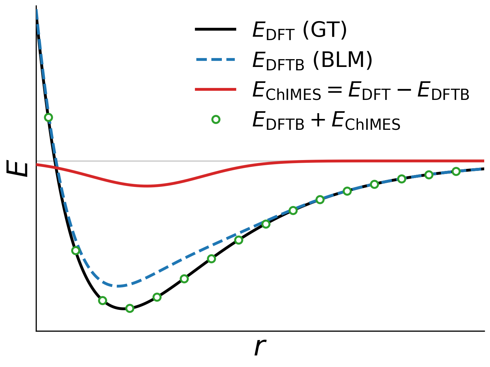
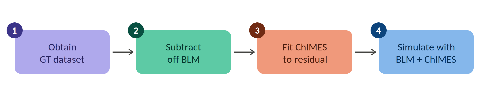
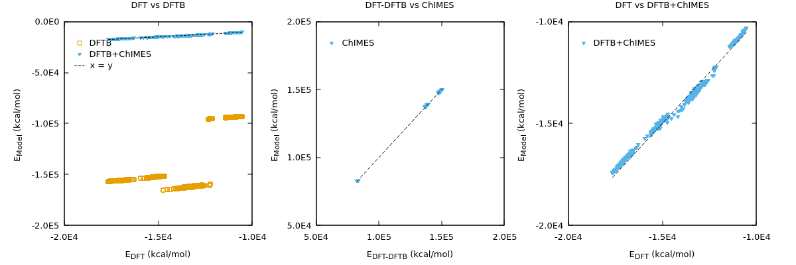

***************************************
Correction Fitting Mode
***************************************

.. Add a tip that can be achieved via hybrid overlay with lammps

  
  Delta-learning overview: Learning a ChIMES correction to bring the baseline model (GT) into agreement with the ground truth (GT)
  

The ChIMES Active Learning Driver (ALD) can be used to generate "delta learned" models. Such models are intended to be deployed in conjunction with some baseline model (BLM) such that the sum of the BLM and "delta learned" ChIMES model approximates some target ground truth (GT).

Hence, for a force-only fit using DFT as the ground truth, the standard ChIMES objective function :math:`F_{\rm{obj}} \propto || \boldsymbol{F}_{\mathrm{DFT}} - \boldsymbol{F}_{\mathrm{ChIMES}} ||` becomes :math:`F_{\rm{obj}} \propto || (\boldsymbol{F}_{\mathrm{DFT}} -\boldsymbol{F}_{\mathrm{BLM}}) - \boldsymbol{F}_{\mathrm{ChIMES}} ||`. 

This strategy can be used for a number of purposes. For example, our `ChIMES Carbon 2.0 Small model <https://doi.org/10.1038/s41524-024-01497-y>`_ is delta learned to the difference between DFT and a dispersion correction. Our :doc:`hierarchical learning strategy <hierarchmode>` delta learns ChIMES cross interactions. This framework can also be used to `fine-tune DFTB models <https://doi.org/10.1063/5.0047800>`_, as we will show here. 

Specifically, we will walk through an example of generating a ChIMES DFTB model correction using the ALD. For additional details on combining ChIMES and DFTB, see the ChIMES recipes in `DFTB+ Recipes <https://dftbplus-recipes.readthedocs.io/en/stable/>`_ 

-------

Background: Components of a DFTB model
===============================================================

DFTB is an approximate, semi-empirical form of density functional theory (DFT)
that gains roughly two orders of magnitude in speed by expanding the DFT total
energy and introducing parameterized approximations. The DFTB energy expression
can be summarized as: 

.. math::

   E_{\mathrm{DFTB}} =
   E_{\mathrm{BS}} + E_{\mathrm{SCC}} + E_{\mathrm{Disp}} + E_{\mathrm{Rep}}
   
where :math:`E_{\mathrm{BS}}`, :math:`E_{\mathrm{SCC}}`, :math:`E_{\mathrm{Disp}}`, 
:math:`E_{\mathrm{Rep}}` are the band structure, self-consistent charge, dispersion, 
and repulsion terms, respectively. The former two terms can be determined bottom-up, 
and are directly tied to the electronic structure of the system. The latter two terms 
can be viewed as correction terms, the first accounting for the long-range London 
dispersion interactions that the underlying minimal-basis electronic structure does 
not capture, and the latter nominally for the short-range repulsion between atoms, 
which subsumes internuclear repulsion together with the double-counting and 
exchange-correlation contributions omitted in reducing the total energy to the 
band-structure and SCC terms. 

The dispersion term is more accurately described as 
empirical in form but largely system-independent: models such as D3 and D4 supply 
atom-pairwise corrections whose coefficients are tabulated from first-principles 
reference data and transferred across systems, with only a small number of global 
parameters fit once against benchmark sets. 

The repulsion term is where the primary system-specific empiricism of DFTB resides. 
:math:`E_{\mathrm{Rep}}` is fit directly to reference data, historically the energies, 
forces, and stresses for system configurations, obtained from higher-level DFT 
calculations or experiment, for the chemistry of interest. The term has conventionally 
been treated as a sum of short-ranged, pairwise, distance-dependent potentials, with one 
repulsive function constructed per element pair. These functions have been represented 
as piecewise polynomials or cubic splines, and in earlier parameterizations as simple 
analytic forms (e.g., exponential or low-order polynomial fits), with a finite 
cutoff radius beyond which the repulsion vanishes. The choice of reference set,
fitting strategy, and hyperparameters strongly shapes transferability, so the repulsive 
potential has long been where the practical art, and much of the inconsistency, of 
DFTB parameterization is concentrated.

**Here, we will overview how to use the ALD to rapidly determine a delta-learned correction for pre-existing DFTB models.**

-------

Workflow
===========================================

For the purpose of these example, we'll take DFT as our GT and a pre-parameterized DFTB model (Mio-1-1)  as our 
BLM. Our goal is to generate: 

.. math::

   E_{\mathrm{ChIMES}} = E_{\mathrm{DFT}} - E_{\mathrm{DFTB}}
   

DFTB+ can then be used to run calculations/simulations that integrate this model and evaluate    

.. math::

   E_{\mathrm{DFTB_{corrected}}} =
   E_{\mathrm{BS}} + E_{\mathrm{SCC}} + E_{\mathrm{Disp}} + E_{\mathrm{Rep}}  + E_{\mathrm{ChIMES}}
   

The basic workflow is as shown below:

  

Given the dataset (training trajectory) indicated in step 1, the ALD can automate steps 2--4.

   
-------

Example
====================================================
   

.. Note::

    Files for this example are located in:
    ``./<al_driver base folder>/examples/correct_dftb_iter_with_dftb``. Note that this example takes quite some time to run, so you are advised to do so in a screen or tmux session.

This example demonstrates generating a ChIMES correction for the Mio-1-1 model in order to describe nitrogen under extreme conditions. The initial dataset is generated via DFT-MD at multiple state points. 

To begin, inspect the contents of the config.py file:

.. code-block:: python 
   :linenos:
   :emphasize-lines: 6, 7, 33-34, 63-69, 86-90, 100-109

   ################################
   ##### General options
   ################################

   ATOM_TYPES	  = ["N"]
   NO_CASES	  = 1
   #STOP_AFTER     = Set this if you do not want to do any active learning. Options are SOLVE_AMAT" or "RUN_MD"

   DRIVER_DIR	  = "/usr/WS2/lindsey11/dftb_tests/al_driver/"
   WORKING_DIR    = "/usr/WS2/lindsey11/dftb_tests/tests/ALD_one_cycle/"
   CHIMES_SRCDIR  = "/usr/WS2/lindsey11/dftb_tests/chimes_lsq/src/"
   DFTBPLUS_EXE   = "/usr/WS2/lindsey11/dftb_tests/dftbplus/installation/bin/dftb+"

   ################################
   #### HPC Settings
   ################################

   HPC_ACCOUNT = "iap"   # Adjust this for your system - this is the charge bank
   HPC_PPN     = 8	 # Just set it to a low number for this excersise

   ################################
   ##### ChIMES LSQ
   ################################

   ALC0_FILES	  = WORKING_DIR + "ALL_BASE_FILES/ALC-0_BASEFILES/"
   CHIMES_LSQ	  = CHIMES_SRCDIR + "../build/chimes_lsq"
   CHIMES_SOLVER  = CHIMES_SRCDIR + "../build/chimes_lsq.py"
   CHIMES_POSTPRC = CHIMES_SRCDIR + "../build/post_proc_chimes_lsq.py"
   CHIMES_MODULES = "intel-classic/2021.6.0-magic mvapich2/2.3.7 mkl" # Adjust this for your system - these are the modules you use for ChIMES

   # Generic weight settings

   WEIGHTS_SET_ALC_0 = True
   WEIGHTS_ALC_0     = ALC0_FILES + "/weights_comb.dat"

   # Regression settings

   REGRESS_ALG   = "dlasso"
   REGRESS_VAR   = "1.0E-7"
   REGRESS_NRM   = True

   # Penalty Prefactor

   CHIMES_PEN_PREFAC = 1000000.0
   CHIMES_PEN_DIST   = 0.02

   # Job submitting settings

   CHIMES_BUILD_NODES = 1
   CHIMES_BUILD_QUEUE = "pdebug"      # Adjust this, this is the queue to submit to
   CHIMES_BUILD_TIME  = "00:05:00"

   CHIMES_SOLVE_NODES = 1
   CHIMES_SOLVE_QUEUE = "pdebug"      # Adjust this, this is the queue to submit to
   CHIMES_SOLVE_TIME  = "00:30:00"
   CHIMES_LSQ_MODULES = CHIMES_MODULES

   ################################
   ##### Molecular Dynamics
   ################################

   MD_STYLE	     = "DFTB+"
   MD_FILES	     = WORKING_DIR + "ALL_BASE_FILES/DFTBMD_BASEFILES/"
   MD_QUEUE	     = ["pdebug"]*NO_CASES
   MD_TIME	     = ["00:10:00"]*NO_CASES
   MD_SER	     = DFTBPLUS_EXE
   MD_NODES	     = [1]*NO_CASES
   MD_OMPEXPORTS     = "export OMP_NUM_THREADS=4 OMP_PLACES=cores OMP_PROC_BIND=close" # Special flags to make DFTB calculations efficient

   RUN_MOLANAL     = True
   MOLANAL	   = CHIMES_SRCDIR + "../contrib/molanal/src/"
   MOLANAL_SPECIES = ["N1", "N2", "N3"]

   ################################
   ##### Correction fitting block - This is where we specify that we want to fit the ChIMES 
   ##### model to the difference between the ground truth (the .xyzf file in ALL_BASEFILES/ALC-0_BASEFILES, DFT in this case) and DFTB.
   ################################

   # Note: if CORRECTED_TEMPS_BY_FILE true, temps in traj_list.dat ignored by correction FES subtraction. 
   # Instead, searches for <filesnames>.temps where .temps replaces whatever last extension was, in 
   # CORRECTED_TYPE_FILES. Temps in traj_list are still used for the MD step, however.

   FIT_CORRECTION	   = True
   CORRECTED_TYPE	   = "DFTB+"
   CORRECTED_TYPE_FILES    = WORKING_DIR + "ALL_BASE_FILES/DFTBSP_BASEFILES/"
   CORRECTED_TYPE_EXE	   = DFTBPLUS_EXE
   CORRECTED_TEMPS_BY_FILE = True 

   ################################
   ##### Single-Point QM -- This is where things get silly. The ALL_BASEFILES/ALC-0_BASEFILES/*.xyzf is DFT therefore this should 
   ##### also be the same DFT method. We're using DFTB here just for code testing purposes. 
   ################################

   # Note: GEN FILENAME IN BASEFILE  MUST BE dftbjob.gen

   BULK_QM_METHOD = "DFTB+"
   IGAS_QM_METHOD = "DFTB+" # Must be defined, even if unused
   QM_FILES	  = WORKING_DIR + "ALL_BASE_FILES/DFTBSP_BASEFILES"   # UPDATE THE MANUAL TO GET RID OF THE DFTBFILES OPTION

   DFTB_MEM	  = 1
   DFTB_NODES	  = 1  
   DFTB_PPN	  = 1
   DFTB_TIME	  = "00:10:00"  
   DFTB_QUEUE	  = "pdebug"  
   DFTB_EXE	  = DFTBPLUS_EXE  
   

Comparing with the ``config.py`` provided in the :ref:`page-basic` example, a few lines are noteworthy:

* **Line 6:** Indicates that iterative learning will only be done for a single case (nominal state point/simulation style)

* **Line 7:** Currently commented out, this variable gives the user the option to stop immediately after generating the parameter file (option ``SOLVE_AMAT``) or immediately after the MD simulation of the first cycle (option ``RUN_MD``); useful if you do not want to do iterative learning. If these are specified, related sections of the input file can be omitted.

* **Lines 33--34:** We are providing a file that explicitly specifies weights for the first cycle. The file contains one line per expected row in the A-matrix, which specifies the weight to apply during regresion. This is a purely optional choice and was done to replicate a fit performed earlier by hand.

* **Lines 63--69:** These lines specify that the MD driver during the learning process will be the supported DFTB code, `DFTB+ <https://dftbplus.org/index.html>`_. Note that this option only makes sense when trying to delta learn a ChIMES correction for DFTB. These lines also indicate that the basefiles for running these simulations will be provided in ``ALL_BASE_FILES/DFTBMD_BASEFILES``. The DFTB+ compilation indicated here includes OpenMP support, hence related variables are provided via ``MD_OMPEXPORTS``.

* **Lines 86--90:** Specify that this run is to generate a correction. ``CORRECTED_TYPE`` indicates what software will be used to evaluate BLM interactions. Currently only ``DFTB+`` is supported -- support for LAMMPS is coming soon. This block also indicates where the files needed to evaluate the BLM interactions are provided -- in this case, ``ALL_BASE_FILES/DFTBSP_BASEFILES/``

* **Lines 100-109:** This bit is for demonstrative purposes. This block is typically where information on how to run the GT calculations is provided. As will be discussed below, the GT established by our training trajecory file is DFT (PBE)in this example. However you can see that we have instead provided DFTB+ as our GT labeling method, which doesn't make sense! We have done so here only to provide an example of how one might specify DFTB as a GT method -- this would be useful in the case of trying to fit a standard ChIMES model to reproduce a trusted DFTB model. 

The neccesary input files and directory tree structure are provided in the example folder, i.e.:

.. code-block:: bash
    :emphasize-lines: 5,8,10,16
    :linenos:

    $ tree
    .
    |-- ALL_BASE_FILES
    |   |-- ALC-0_BASEFILES
    |   |   |-- ChIMES-N.Order-50_15_5.ALC_1-5.PBE_OUTCAR.temps
    |   |   |-- ChIMES-N.Order-50_15_5.ALC_1-5.PBE_OUTCAR.xyzf
    |   |   |-- fm_setup.in
    |   |   |-- traj_list.dat
    |   |   `-- weights_comb.dat
    |   |-- DFTBMD_BASEFILES
    |   |   |-- bonds.dat
    |   |   |-- case-0.indep-0.dftb_in.hsd
    |   |   |-- case-0.indep-0.gen
    |   |   |-- N-N.skf
    |   |   `-- run_molanal.sh
    |   `-- DFTBSP_BASEFILES
    |       |-- 2000.dftb_in.hsd
    |       |-- 300.dftb_in.hsd
    |       |-- 5000.dftb_in.hsd
    |       |-- 6000.dftb_in.hsd
    |       |-- 7000.dftb_in.hsd
    |       |-- 8000.dftb_in.hsd
    |       `-- N-N.skf
    |-- config.py
    `-- expected.params.txt

Comparing with the ``ALC-0_BASEFILES`` folder provided in the :ref:`page-basic`, we can observe the following:

* **Line 5:** There is a new type of file called ``ChIMES-N.Order-50_15_5.ALC_1-5.PBE_OUTCAR.temps`` in ``ALL_BASE_FILES/ALC-0_BASEFILES``. This file contains one line for each frame of the training trajectory (``ChIMES-N.Order-50_15_5.ALC_1-5.PBE_OUTCAR.xyzf``) and specifies the corresponding electron temperature, ensuring the correct value is used for each frame's BLM calculation when determining the GT-BLM residuals. A user-provided ``.temps`` file (indicated by setting ``CORRECTED_TEMPS_BY_FILE = True``) is only needed when a single training file collates frames from multiple state points, as is the case here (frames span 300--8000 K, matching the ``*.dftb_in.hsd`` files in ``DFTBSP_BASEFILES``). If each training file corresponds to a single state point, this option can be omitted, and the ALD will automatically assign each file's frames the temperature listed for that file in ``traj_list.dat`` (structured as described in :ref:`page-basic`).

* **Line 10:** This is where the files needed to run DFTB-MD simulations are placed. As in other examples, we provide the input structure file(s) (``*.gen``) and simulation specification files (``*.hsd``). A ``*.skf`` is also provided for each atom pair type. An optional ``bonds.dat`` file is included to facilitate speciation analysis via ``molanal`` -- see option ``RUN_MOLANAL`` in the :doc:`options page <options>`.

* **Line 16:** This folder contains the files neccessary to run the BLM calculations for the GT-BLM residuals. The ``*.hsd`` files are configured for a DFTB+ single point calculation for the target system using the target electron temperature; each of these use Mio-1-1 parameters as defined in the ``N-N.skf`` file.

Evaluating Fit Performance
====================================================

After running the ALD, the following files will be produced. The output below corresponds to a single cycle:

.. code-block:: bash
    :emphasize-lines: 5,9,15
    :linenos:
   
    |-- b-labeled_full.traj_file_idx-0.dat
    |-- b-labeled_subtracted..traj_file_idx-0.dat
    |-- CASE-0_INDEP_0 # Files for DFTB+ChIMES MD run
    |   |-- ...
    |   |-- params.txt.reduced
    |   `-- ...
    |-- DFTB-20 # Files for DFTB single point for training set supplementation
    |   `-- ...
    |-- forceout.txt
    |-- GEN_FF
    |   |-- ...
    |   |-- b-labeled_comb.txt
    |   |-- ...
    |   |-- force.txt
    |   |-- ...
    |   |-- params.txt
    |   |-- params.txt.reduced
    |   `-- ...
    `-- ...

**Parameter files** : Lines XX indicate 3 different parmeter files are produced, one params.txt and two params.txt.reduced. They all contain the same parameters. The differences are: (1) params.txt vs params.txr.reduced -- the latter has been post-processed to delete any parameters that have a value of zero to improve compuational efficiency during simulation; (2) the params.txt.reduced in the CASE* folder has penalty function parameters added in. 

Parity plots are a common quick assessment of model training performance. For a delta-learned model, one can constuct many such parity plots per-property:

#. **GT vs BLM:** Tells you how accurate the original BLM model was with respect to the target GT
#. **GT-BLM vs ChIMES:** Tells you how well ChIMES learned the residual
#. **GT vs BLM+ChIMES:** Tells you how well the new ChIMES-corrected BLM model performas with respect to the target GT.

The data needed to make these plots are available in the files shown below. Namely:

* ``b-labeled_full.traj_file_idx-0.dat:`` Forces (F) and optionally energies (E) and stresses (S) in training set, **labeled by the GT method** 
* ``b-labeled_subtracted..traj_file_idx-0.dat:`` F, E, and optionally S **labeled by the BLM method**
* ``b-labeled_comb.txt:`` **GT - BLM** for each F, E, and optionally S
* ``force.txt:`` **ChIMES value** for each F, E, and optionally S (fit to GT - BLM)

Hence, you can use a script like the following to generate your parity plots:

.. code:: bash

   #!/bin/bash
   
   # Run from your ALC-*/GEN_FF folder

   # What we're starting with: DFT vs DFTB
   paste b-labeled_full.traj_file_idx-0.dat b-labeled_subtracted..traj_file_idx-0.dat > compare_all_DFTvsDFTB.txt

   # What we're trying to fit ChIMES to: DFT-DFTB vs ChIMES
   paste GEN_FF/b-labeled_comb.txt GEN_FF/force.txt > compare_all_DFT-DFTBvsChIMES.txt

   # Our target final prodcut: DFT vs DFTB+ChIMES
   paste b-labeled_full.traj_file_idx-0.dat b-labeled_subtracted..traj_file_idx-0.dat GEN_FF/force.txt | awk '{print($1, $2, $4+$5)}' > compare_all_DFTvsDFTB+ChIMES.txt

   # Now let's break these up into force, energy, and stress. Units will be in terms of kcal/mol, Angstrom

   awk '/N/ {print($2,$4)}' compare_all_DFTvsDFTB.txt > compare_F_DFTvsDFTB.txt
   awk '/s/ {print($2,$4)}' compare_all_DFTvsDFTB.txt > compare_S_DFTvsDFTB.txt
   awk '/\+1/{print($2,$4)}' compare_all_DFTvsDFTB.txt > compare_E_DFTvsDFTB.txt

   for i in DFT-DFTBvsChIMES DFTvsDFTB+ChIMES
   do
   	   awk '/N/ {print($2,$3)}' compare_all_${i}.txt > compare_F_${i}.txt
   	   awk '/s/ {print($2,$3)}' compare_all_${i}.txt > compare_S_${i}.txt
   	   awk '/\+1/{print($2,$3)}' compare_all_${i}.txt > compare_E_${i}.txt
   done
   
You can then plot the results with your chosen plotting software. For example, to examine the energy fitiing, you can use the following gnuplot ocmmands:

.. code:: bash
  
   eval "set terminal " . GPVAL_TERM . " size 1200, 400"
   set multiplot layout 1,3 margins 0.08, 0.95, 0.15, 0.92 spacing 0.08, 0.1
   set key samplen 1 left Left reverse offset 0,-1
   set format x "%g"
   set format y "%g"

   # Energy parity plots

   set title "DFT vs DFTB"
   set format y "%.1tE%T"
   set format x "%.1tE%T"
   set xlabel "E_{DFT} (kcal/mol)"
   set ylabel "E_{Model} (kcal/mol)"
   set xtics 5000
   set ytics 50000
   p 'compare_E_DFTvsDFTB.txt'        w p pt  4 lc  4 t 'DFTB', \
     'compare_E_DFTvsDFTB+ChIMES.txt' w p pt 11 lc 11 t 'DFTB+ChIMES', \
     x w l dt 2 lc "black" t 'x = y'
    
   set title "DFT-DFTB vs ChIMES"
   set format y "%.1tE%T"
   set format x "%.1tE%T"
   set xlabel "E_{DFT-DFTB} (kcal/mol)"
   set ylabel "E_{Model} (kcal/mol)"
   set xtics 50000
   set ytics 50000
   p 'compare_E_DFT-DFTBvsChIMES.txt' w p pt 11 lc 11 t 'ChIMES', \
     x w l dt 2 lc "black" t ''
     
   set title "DFT vs DFTB+ChIMES"
   set format y "%.1tE%T"
   set format x "%.1tE%T"
   set xlabel "E_{DFT} (kcal/mol)"
   set ylabel "E_{Model} (kcal/mol)"
   set xtics 5000
   set ytics 5000
   p 'compare_E_DFTvsDFTB+ChIMES.txt' w p pt 11 lc 11 t 'DFTB+ChIMES', \
     x w l dt 2 lc "black" t ''
     
     
The result should be the following:

-------

DFTB+ with ChIMES
====================================================
   
If run with ``STOP_AFTER = "SOLVE_AMAT"``, generated models will be available in ``ALC-1/GEN_FF/params.txt``, without penalty parameters added. For any other type of run (``SOLVE_AMAT = RUN_MD`` or not specified), it is recommended to take paratmeter files from the last of any of ``ALC-*/CASE*/params.txt.reduced``.

``ALL_BASE_FILES/DFTBMD_BASEFILES/case-0.indep-0.dftb_in.hsd`` provides an example of how to run a DFTB+ calculation with ChIMES. As is shown in the ``Hamiltonian`` block:

.. code-block:: python
   :emphasize-lines: 12-14
   :linenos:

   Hamiltonian = DFTB {
     SCC	      = Yes
     SCCTolerance     = 1e-6
     MaxSCCIterations = 200
     ShellResolvedSCC = No
     MaxAngularMomentum = {
       N = "p"
     }
     Dispersion = LennardJones {
       Parameters = UFFParameters {}
     }
     Chimes {
       ParameterFile = "params.txt"
     }
     Filling = Fermi {
       Temperature [K] = 6000.0
     }
     Mixer = Broyden {
       MixingParameter = 0.05
     }
     SlaterKosterFiles = Type2FileNames {
       Prefix	 = "/usr/workspace/wsb/lindsey11/dftb_tests/mio-1-1/"
       Separator = "-"
       Suffix	 = ".skf"
     }
     ...
   }
   
   
-------

Tips and Tricks
====================================================

  * **Delta learning is not always a good choice!** Delta learning is only beneficial when the :math:`\mathrm{GT}-\mathrm{BLM}` residual is less than :math:`\mathrm{GT}-\mathrm{Nothing}`.
  * For recommendations on setting ChIMES hyperparameters for correction fitting, see the ChIMES recipes in `DFTB+ Recipes <https://dftbplus-recipes.readthedocs.io/en/stable/>`_ 
