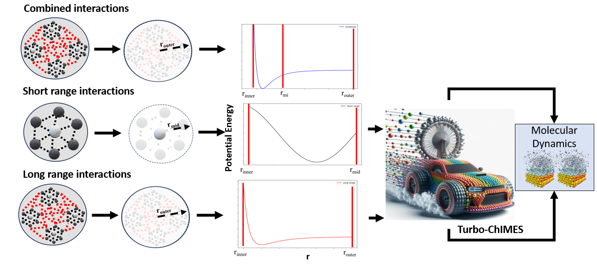

.. _page-turboChimes:

***************************************
TurboChIMES Fitting Mode
***************************************

  
  **Fig. 1:** The TurboChIMES fitting framework.

TurboChIMES framework is designed to account for both short and long-range interactions effectively using a low-complexity model. This offers two major advantages which include accounting for long-range physics more effectively at relatively low complexity and computational cost. This framework has been integrated into the Active learning driver to ensure a smooth design matrix development and simulation. The figure shows how this model accounts for both short and long-range interactions separately.

.. **UPDATE JOURNAL** ... this would be for C/N ... try for JCTC   `(link) < UPDATE >`_

-------

============================
Example Fit: Propane system
============================

.. Note ::

    Files for this example are located in ``./<al_driver base folder>/examples/simple_iter_single_statepoint-lmp-test-turbo-test``
    
In this section, an example 3-iteration fit for propane. The example allows us to look at the short-range effect within a propane molecule and the long-range Van der Waal effect between different propane molecules within the simulation box.

The necessary input files and directory tree structure are provided in the example folder, i.e.:

.. code-block :: 
    :emphasize-lines: 4,14-16

    $: tree 
    .
    ALL_BASE_FILES/
├── ALC-0_BASEFILES
│   ├── 0.fm_setup.in
│   ├── 1.fm_setup.in
│   ├── test_data.xyzf
│   └── traj_list.dat
├── LMP_BASEFILES
│   ├── 1.data.in
│   └── 1.in.lammps
 ── LMPMD_BASEFILES
    ├── bonds.dat
    ├── case-0.indep-0.data.in
    ├── case-0.indep-0.in.lammps
    └── case-0.skip.dat

    
Compared with the ``ALC-0_BASEFILES`` folder provided in the:ref:`page-basic`, the primary difference is the ``LMPMD_BASEFILES`` and ``LMP_BASEFILES`` directory, i.e., which contains the files required to run the LAMMPs simulation and QM respectively. Other differences include the 0.fm_setup.in includes the hyperparameters and cut_offs  for the short-range interaction while the 1.fm_setup.in includes that for the long range.

-------

------------------------------------------
Input Files 
------------------------------------------

~~~~~~~~~~~~~~~~~~~~~~~~~~~~~~~~
The config.py File
~~~~~~~~~~~~~~~~~~~~~~~~~~~~~~~~

The `config.py` file is given below:

.. code-block :: python
    :linenos:
    :emphasize-lines: 55-57
    
    ################################
 2##### General variables
 3################################
 4
 5EMAIL_ADD     = "lindsey11@llnl.gov" # driver will send updates on the status of the current run ... If blank (""), no emails are sent
 6
 7ATOM_TYPES = ['C']
 8NO_CASES = 1
 9
 10DRIVER_DIR     = "/p/lustre2/rlindsey/al_driver/src/"
 11WORKING_DIR    = "/p/lustre2/rlindsey/al_driver/examples/hierarch_fit"
 12CHIMES_SRCDIR  = "/p/lustre2/rlindsey/chimes_lsq/src/"
 13
 14################################
 15##### ChIMES LSQ
 16################################
 17
 18ALC0_FILES    = WORKING_DIR + "ALL_BASE_FILES/ALC-0_BASEFILES/"
 19CHIMES_LSQ    = CHIMES_SRCDIR + "../build/chimes_lsq"
 20CHIMES_SOLVER = CHIMES_SRCDIR + "../build/chimes_lsq.py"
 21CHIMES_POSTPRC= CHIMES_SRCDIR + "../build/post_proc_chimes_lsq.py"
 22
 23# Generic weight settings
 24
 25WEIGHTS_FORCE =   1.0
 26
 27REGRESS_ALG   = "dlasso"
 28REGRESS_VAR   = "1.0E-5"
 29REGRESS_NRM   = True
 30N_HYPER_SETS  = 2
 31# Job submitting settings (avoid defaults because they will lead to long queue times)
 32
 33CHIMES_BUILD_NODES = 2
 34CHIMES_BUILD_QUEUE = "pdebug"
 35CHIMES_BUILD_TIME  = "01:00:00"
 36
 37CHIMES_SOLVE_NODES = 2
 38CHIMES_SOLVE_QUEUE = "pdebug"
 39CHIMES_SOLVE_TIME  = "01:00:00"
 40
 41################################
 42##### Molecular Dynamics
 43################################
 44
 45MD_STYLE        = "LMP"
 46MD_QUEUE          = ["skx"]*NO_CASES
 47MD_TIME           = ["1:00:00"]*NO_CASES
 48CHIMES_MD_MPI     = "/work2/09982/aoladipupo/stampede3/codes/chimes_calculator-LLfork/etc/lmp/exe/lmp_mpi_chimes"
 49MD_NODES          = [1]*NO_CASES
 50MDFILES          = WORKING_DIR + "/ALL_BASE_FILES/LMPMD_BASEFILES/"
 51MD_MPI            = "/work2/09982/aoladipupo/stampede3/codes/chimes_calculator-LLfork/etc/lmp/exe/lmp_mpi_chimes"
 52MOLANAL         = CHIMES_SRCDIR + "../contrib/molanal/src/"
 53MOLANAL_SPECIES = ["C1"]
 54CHIMES_MODULES = "intel/24.0 impi/21.11 cmake/3.29.5"
 55################################
 56##### Single-Point QM
 57################################
 58BULK_QM_METHOD = "LMP"
 59IGAS_QM_METHOD = "LMP" # Must be defined, even if unused
 60QM_FILES       = WORKING_DIR + "ALL_BASE_FILES/LMP_BASEFILES"
 61
 62LMP_EXE      = "/work2/09982/aoladipupo/stampede3/codes/chimes_calculator-LLfork/etc/lmp/exe/lmp_mpi_chimes" # Has class2 compiled in it
 63LMP_UNITS    = "REAL"
 64LMP_TIME     = "00:10:00"
 65LMP_NODES    = 1
 66LMP_PPN      = 1
 67LMP_MEM      = 48
 68LMP_QUEUE    = "skx"
 69LMP_MODULES  = "intel/24.0 impi/21.11"

    
The primary difference between the present ``config.py`` and that provided in the  file :ref:`page-basic` documentation is the N_HYPER_SETS which has to be given a value of 2 this informs ALD that he needs to use the TurboChIMES fitting framework. It is important to note that to use the TurboChIMES framework the Molecular dynamics portion of the code has to be done using LAMMPS. This is because the code is going to be generating two pair types one for short range and the other for long range LAMMPS has been designed to handle multiple pair types using the hybrid overlay pair type. If N_HYPER_SETS is set to one then the Basic or Hierarch fitting approach would be done depending if the config file HIERARCH parameter as been set to true..

------------------------------------------
Running
------------------------------------------

-------

------------------------------------------
Inspecting the output
------------------------------------------

-------

========================================================
In-depth Setup and Options Overview
========================================================

For detailed instructions on setting up and running the ALD, see the :ref:`page-basic`
